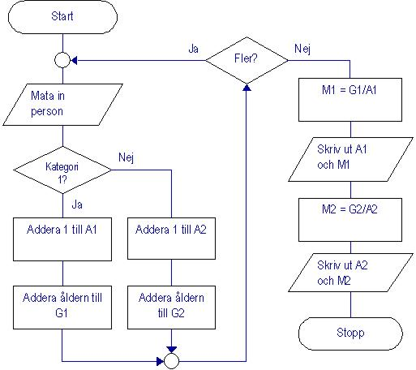

# Programmering 1

## B-uppgiften: Genomsnittsålder
   
   Skriv ett program som läser in uppgifter om ett antal personer,
   
   och beräknar genomsnittsåldern för kvinnor respektive män i gruppen.
   
   Följ följande Strukturdiagram (flödesschema) noga!
   
   
   
   **OBS! Läs noga vad som står i uppgiftsbeskrivningen, så att du har koll på allt du behöver veta om uppgiften!**

***
## Kurslitteratur
***Titel***: Java: steg för steg (Enbart kapitel 1-8)

***Författare***: Jan Skansholm

***ISBN***: 9789144085876

***Förlag***: Studentlitteratur AB

På bokens hemsida finns ­kompletterande material, tex. lösningar till alla övningar och programmeringsuppgifter.

[http://skansholm.com/javasteg/](http://skansholm.com/javasteg/)
